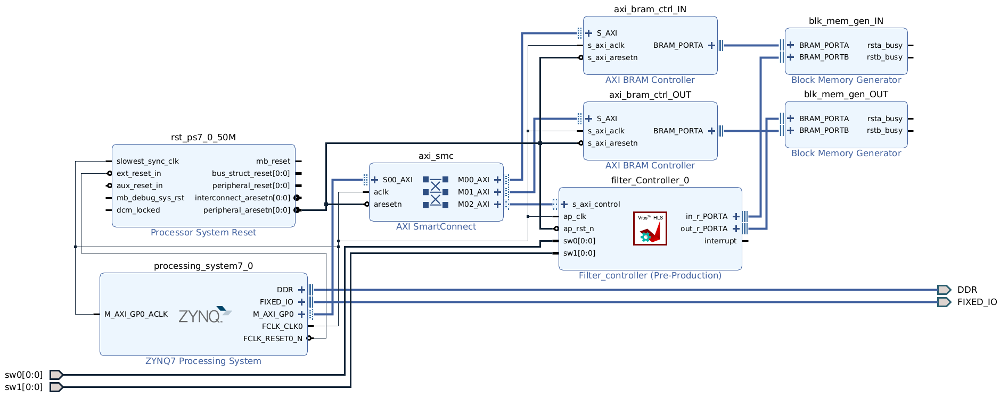
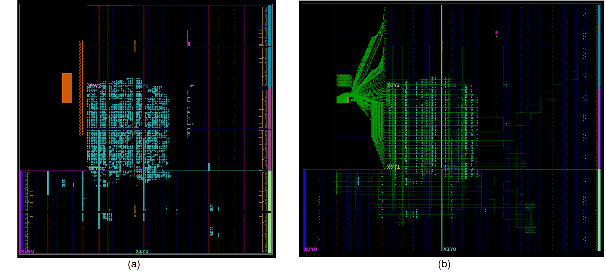
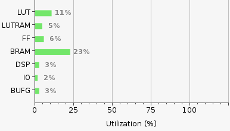
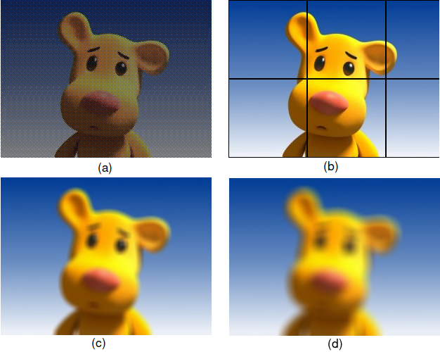

# Project definition and architecture

The objective of this project is to design a simple Hardware/Software embedded system, targeting the PYNQ-Z2 board. The system must implement four image filters, multiplexed throught the on-board switches.

## Project wide concepts

The data transferred between the Processing System (PS) and the Programmable Logic (PL) is made in regular, fixed-sized data blocks. Each data block is consists of a useful block padded in each side left and right top and bottom with 8 additional-pixels, this facilitates our implementation as will be detailed later.

## Hardware Design with HLS

Certain objectives were defined at the project ideation to ensure a viable and efficient hardware design:

* Avoid using full-divisor blocks, opting instead to multiplicate by the reciprocal;
* Avoid border conditions, opting to pad the input data beforehand.

We harnessed the simplicity that **ap_int** and **ap_fixed** types introduce, making the C-code variables more similiar to VHDL signals.

### Baseline ("naive") Blur Implementation

The Baseline implementation consists of a simple algorithm: "For each pixel sum (access) all in-memory pixel values contained within the kernel centered in that pixel, except the pixel itself"

Since only one kernel is computed at a time, multiple accesses to the same pixel are needed, to compute distinct kernels.

### "Ideal" Blur Implementation (not implemented in hardware)

The naive implementation, is understandbly inneficient, requiring multiple accesses to the same data.
For each data access all arithmetic operations that require this data must be concretized in that same cycle to achieve a throughput of 1. For the blur filter this means for each accessed pixel its values must be added to all corresponding kernels which use it.

This implementation requires an array of accumulators, ideally registers, where to store the kernel values in parallel computation.
The number of kernels being computed simultaneously is equal to:

$$
N_{Accumulators}=((2 \times Radius_{Kernel})+1) \times UsableWidth_{DataBlock}
$$

For the designed Data Block and a Kernel Radius of 8

$$
N_{Accumulators}=((2 \times 8)+1) \times (128-16)=1904
$$

For a kernel radius of 8, 288 accumulations are made, which at a maximum are of value 255 (considering RGB channel separation). The maximum accumulator value is calculated as

$$
Max_{AccumValue} = 288 \times 255= 73440_{10} = 1DD0_{16} = 1 0001 1110 1110 0000_2
$$

which requires 17 bits to be represented therefore each accumulator must be 17 bits wide in order to avoid overflows. However, while testing we still faced overflow problems with this radius, which was fixed by increasing the accumulators' width by 1 bit.

This same process can be applied to determine the accumulator bit width for the kernel of radius 4.

Finally the total number of flip-flops needed is given as

$$
N_{FF} = C \times Accumulator_{BitWidth} \times N_{Accumulators} = 3 \times 17 \times 1904 = 97104
$$

which is around **91.6%** of the PYNQ-Z2's Zynq-7020 flip-flop resources ^[[Zynq-7000 SoC Data Sheet](https://www.amd.com/content/dam/xilinx/support/documents/data_sheets/ds190-Zynq-7000-Overview.pdf)], much larger than the recommended 70% maximum usage.

Due to the large number of registers, the HLS tool Vitis maps the accumulator array to a **BRAM**, adding additional latency to this design, reason why this implementation was discarded as **unviable**.

## Data Block Division and Data Packing

Each data block is of size $128 \times 128$ pixels, where the middle $112 \times 112$ pixels are the relevant data. The surrounding 8 pixel-frame works as padding and ensures that no border conditions exist, allowing the averaging kernel value to **always be "divided" by a constant**.

The $128 \times 128$ size was selected based on following table

| Block  Dimension | Usable Block Dimension | Usable Block [% of total] | Occupied Zynq-7020 BRAM [%] | Fits in Zynq-7020 BRAM? |
|:----------------:|:----------------------:|:-------------------------:|:---------------------------:|:-----------------------:|
|  $64 \times 64$  |     $48 \times 48$     |           56.3            |              5              |      $\checkmark$       |
| $128 \times 128$ |    $112 \times 112$    |           76.6            |             20              |      $\checkmark$       |
| $256 \times 256$ |    $240 \times 240$    |           87.9            |             80              |           ??            |
| $512 \times 512$ |    $496 \times 496$    |           93.8            |            >200             |        $\times$         |

Although two (input and output) $256 \times 256$ data blocks could have fit in the BRAMs, the BRAM usage would be far above the recommended 25%.

To simplify the designed IP and assembled system and to ensure the place and route and area constrains were met, **32-bit RGB packing** was adopted.

Compared to the adopted packing, single channel packing can have a more efficient word usage, with 4 pixel values per 32-bit word, althougth it may occupy additional area.

For comparison for the $128 \times 128$ block the RGB packing utilizes 16384 words of 32-bit, at a total cost of a single 64KiB BRAM, while the single channel packing utilizes 4096 32-bit words per channel with a reduced cost of 3 independent 4KiB BRAMs (12KiB total).
The latter implementation, although more memory efficient, would also require additional AXI BRAM Controllers, which could also constrain our system in terms of Area and Power ^[[AXI BRAM Controller IP Guide](https://www.amd.com/en/products/adaptive-socs-and-fpgas/intellectual-property/axi_bram_if_ctlr.html)] ^[[AXI BRAM Controller Resource Utilization](https://download.amd.com/docnav/documents/ip_attachments/axi-bram-ctrl.html)].
The single-channel packing also has the advantage of allowing each channel to be computed in parallel, in addition to the parallellization implemented in the IP by the HLS tool, althougth this requires 3 independent IP instances.

## Programmable Logic (PL) Hardware

The IP synthetized from Vitis is based on the previously described baseline implementation for the blur filter.

Memory-Mapped I/O from the processing system is used by employing two AXI BRAM controllers which connect to the respective input and output BRAMs in the Programmable Logic. The storage required for each BRAM is determined as follows

$$
Size_{InputBRAM} = 128 \times 128 \times 4 = 64KiB
$$
$$
Size_{OutputBRAM} = 112 \times 112 \times 4 = 49KiB
$$

since the BRAM depth is of base-two KiB (starting at 4KiB) both BRAMs were packed with size 64KiB.

The final block design, the final layout and the routed resources layout are presented below

{width=75%}

## Processing System (PS) Software

The PS Software consists of two main parts

- Image padding and preparation
- Data encoding, decoding and slicing into the pre-determined fixed-size data blocks

### Padding and Preparation

In order to process images with height or width smaller than those of the used datablocks, a simple nearest-neighbour pad is utilized, completing the remainder height and/or width to fit as a multiple of the usable data block.

To avoid the border conditions, as defined in the HLS objectives, an additional 8-pixel nearest-neighbour padding frame is employed, so that the maximum kernel radius of 8 would not go out of bounds. This frame is useful only on data blocks that contain the image borders. In data blocks that do not contain borders this frame padding is done by using an 8 pixel frame surrounding the usuable data block. This results in the same pixels being sent to the BRAM multiple times, and results in smoother borders of each output data block.

### Encoding-Decoding Optimization

Initially two nested for-loops were used for encoding the data being passed between the PS and the PL, operating only over the data that would be used for the target data block to be processed. Decoding was done in the same way, iterating over each pixel of the output data block to unpack it back into 3 distinct channels.

As Python is an interpreted language nested-loops are fairly inneficient. To remove this time constrain two strategies were adopted. Encoding the whole image instead of only encoding it when sending the data block to the PL and vectorial NumPy operations (which are wrapped around C) instead of the nested for-loops.

To write to the PL, the target data block is sliced directly from the encoded array, using NumPy operators.

Finally to read from the PL, to reconstruct the image array (in decoded format i.e. with three channels), NumPy vectorial operations are again employed, shifting the whole data block 3 times (once for each channel), and storing it in the corresponding image position.

# Project Profiling and Results

## Power, Timing and Area Report

The power, timing and area reports for a $128 \times 128$ data block based IP are presented in the following tables and image

| Worst Negative (Setup) Slack[ns] | Total Negative (Setup) Slack [ns] | Worst Hold Slack [ns] | Total Hold Slack [ns] | Total Number of endpoints |
|:--------------------------------:|:---------------------------------:|:---------------------:|:---------------------:|:-------------------------:|
|               9.796              |                0.0                |         0.018         |          0.0          |           20855           |

| On-chip Dynamic Power[W] | On-chip Static Power[W] | On-chip total Power[W] |
|:------------------------:|:-----------------------:|:----------------------:|
|           1.598          |          0.141          |          1.739         |

{width=45%}

The designed hardware passed on timing, area and power constrains being able to be successfully implemented and a bitstream and hardware hand-off generated.

## Filter Profiling

The Hardware/Software system produced the following results

{width=50%}

which are in accordance with those expected.

For the provided benchmark images and a data block of size $128 \times 128$ the execution time for each filter is presented in the table below

| Image Name | Image Size [$p \times p$] | $t_{Checkered}$ [s] | $t_{Frame}$ [s] | $t_{Blur, Radius=4}$ [s] | $t_{Blur, Radius=8}$ [s] |
|:----------:|:-------------------------:|:---------:|:-----------------:|:--------------:|:--------------:|
| image0.jpg |      $300 \times 224$     |    0.38   |        0.38       |      0.57      |      1.08      |
| image1.jpg |     $1920 \times 1080$    |   10.73   |       10.74       |      16.53     |      31.56     |
| image2.jpg |     $5184 \times 3456$    |   131.57  |       127.37      |     173.26     |      296.1     |
| image3.jpg |     $640 \times 1136$     |    3.96   |        3.96       |      6.10      |      11.60     |
| image4.jpg |     $2192 \times 917$     | 10.75     | 10.81             | 16.59          | 31.62          |
| image5.jpg |      $216 \times 86$      |   0.13    |       0.13        |      0.2       |      0.38      |
| image6.jpg |    $1600 \times 1600$     |   13.43   |       13.51       |     20.73      |     39.61      |
| image7.jpg |     $1530 \times 108$     | 0.86      | 0.86              | 1.31           | 2.49           |
| image8.jpg |      $2000 \times 14$     | 1.11      | 1.1               | 1.68           | 3.18           |
| image9.jpg | $1116 \times 1781$        | 9.74      | 9.59              | 14.73          | 28.06          |

# Conclusions

Overall the task presented is not suited for Hardware acceleration, especially with the PYNQ board. The first two filters have little arithmethic intensity, and  while the blur filter can be approached in a less memory intense way this approach will require much more programmable logic register memory.

A middle-way between the two implementations could have been achieved, with less kernels being computed in parallel and with some repeated accesses to memory, this however, would be non-trivial to design the control for.
