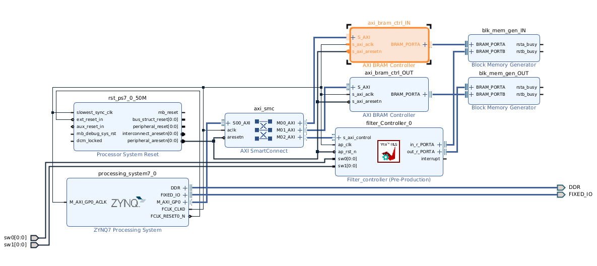

# Project Architecture

## Hardware Design with HLS

Certain objectives were defined at the project ideation to ensure a viable and efficient hardware design:

* Avoid using full-divisor blocks, opting instead to multiplicate by the reciprocal
* Avoid border conditions, opting to pad the input data beforehand

We harnessed the simplicity that **ap_int** and **ap_fixed** types introduce, making the C-code variables more similiar to VHDL signals.

### Baseline ("naive") Blur Implementation

The Baseline implementation consists of a simple algorithm:

\begin{center}
"For each pixel sum (access) all in-memory pixel values contained in the kernel centered in that pixel"
\end{center}

Since only one kernel is computed at a time, multiple accesses to the same pixel are needed, to compute distinct kernels.

### "Ideal" Blur Implementation (not implemented in hardware)

The naive implementation, is understandbly inneficient, requiring multiple accesses to the same data.
For each data access all arithmetic operations that require this data must be concretized in that same cycle to achieve a throughput of 1. For the blur filter this means that for each accessed pixel its values must be added to all corresponding kernels that use it.

This implementation requires an array of accumulators, ideally registers, where to store the kernel values in parallel computation.
The number of kernels being computed simultaneously is equal to:

$$
N_{Accumulators}=((2 \times Radius_{Kernel})+1) \times UsableWidth_{DataBlock}
$$

For the designed Data Block and a Kernel Radius of 8

$$
N_{Accumulators}=((2 \times 8)+1) \times (128-16)=1904
$$

For a kernel radius of 8, 288 accumulations are made, which at a maximum are of value 255 (considering RGB channel separation). The maximum accumulator value is calculated as

$$
Max_{AccumValue} = 288 \times 255= 73440_{10} = 1DD0_{16} = 1 0001 1110 1110 0000_2
$$

which requires 17 bits to be represented therefore each accumulator must be of bit width 17 in order to avoid overflows.

\newpage

Finally the total number of flip-flops needed is given as

$$
N_{FF} = C \times Accumulator_{BitWidth} \times N_{Accumulators} = 3 \times 17 \times 1904 = 97104
$$

which is around **91.6%** of the PYNQ-Z2's Zynq-7020 flip-flop resources ^[[Zynq-7000 SoC Data Sheet](https://www.amd.com/content/dam/xilinx/support/documents/data_sheets/ds190-Zynq-7000-Overview.pdf)], much larger than the recommended 70% maximum usage.

Due to the large number of registers, the HLS tool Vitis maps the accumulator array to a **BRAM**, adding additional latency to this design, reason why this implementation was discarded as **unviable**.

### Additional notes on possible optimizations

## Data Block Division and Data Packing

Each data block is of size $128 \times 128$ pixels, where the middle $112 \times 112$ pixels are the relevant data. The surrounding 8 pixel-frame works as padding and ensures that no border conditions exist, allowing the averaging kernel value to **always be "divided" by a constant**.

The $128 \times 128$ size was selected based on following table

| Block  Dimension | Usable Block Dimension | Usable Block (% of total) | Occupied Zynq-7020 BRAM (%) | Fits in Zynq-7020 BRAM? |
|:----------------:|:----------------------:|:-------------------------:|:---------------------------:|:-----------------------:|
|  $64 \times 64$  |     $48 \times 48$     |           56.3            |             5               |      $\checkmark$       |
| $128 \times 128$ |    $112 \times 112$    |           76.6            |            20               |      $\checkmark$       |
| $256 \times 256$ |    $240 \times 240$    |           87.9            |             80              |           ??            |
| $512 \times 512$ |    $496 \times 496$    |           93.8            |            >200             |        $\times$         |

Although two (input and output) $256 \times 256$ data blocks could have fit in the BRAMs, the BRAM usage would be far above the recommended 25%.

To simplify the designed IP and assembled system and to ensure the place and route and area constrains were met, **32-bit RGB packing** was adopted.

Compared to the adopted packing, single channel packing can have a more efficient word usage, with 4 pixel values per 32-bit word, althougth it may occupy additional area.

For comparison for the $128 \times 128$ block the RGB packing utilizes 16384 words of 32-bit, at a total cost of a single 64KiB BRAM, while the single channel packing utilizes 4096 32-bit words per channel with a reduced cost of 3 independent 4KiB BRAMs (12KiB total).
The latter implementation, although more memory efficient, would also require additional AXI BRAM Controllers, which could also constrain our system in terms of Area and Power ^[[AXI BRAM Controller IP Guide](https://www.amd.com/en/products/adaptive-socs-and-fpgas/intellectual-property/axi_bram_if_ctlr.html)] ^[[AXI BRAM Controller Resource Utilization](https://download.amd.com/docnav/documents/ip_attachments/axi-bram-ctrl.html)].
The single-channel packing also has the advantage of allowing each channel to be computed in parallel, in addition to the parallellization implemented in the IP by the HLS tool, althougth this requires 3 independent IP instances.

## Programmable Logic (PL) Hardware

The IP synthetized from Vitis is based on the previously described baseline implementation for the blur filter.

Memory-Mapped I/O from the processing system is used by employing two AXI BRAM controllers which connect to the respective input and output BRAMs in the Programmable Logic. The storage required for each BRAM is determined as follows
$$
Size_{InputBRAM} = 128 \times 128 \times 4 = 64KiB
$$
$$
Size_{OutputBRAM} = 112 \times 112 \times 4 = 49KiB
$$

since the BRAM depth is of base-two KiB (starting at 4KiB) both BRAMs were packed with size 64KiB.

The final block design is presented below

The final layout is as follows

## Processing System (PS) Software

Initially two nest for-loops were for each encoding and decoding of the data being passed between the PS and the PL, enconding only the data that would be used for the target data block.

As Python is an interpreted language nested-loops are fairly inneficient. To remove this time constrain an whole image encoding strategy was adopted, using vectorial numpy operations (which are wrapped around C). The each channel is shifted and concatenated into the new array in full, instead of pixel-by-pixel.

To write to the PL, from the produced encoded array the corresponding data block to be transfered can be sliced directly and stored in the inMat Memory-Mapped I/O (MMIO) array.

Finally to read from the PL, to reconstruct the image array (in decoded format i.e. with three channels), numpy vectorial operations are again employed, shifting the whole data block 3 times (once for each channel), and stored in the corresponding image position.

\newpage

# Project Profiling and Results

### Blur Filter Profiling

For the provided benchmark images the execution time for the smaller Blur filter were

| Image Name | Image Size ($p \times p$) | Padded Image Size ($p \times p$) | Execution time for Blur w/ Radius=4  (s) |
|:----------:|:-------------------------:|:--------------------------------:|:----------------------------------------:|
| image0.jpg | $300 \times 224$          | $300 \times 224$                 |                                          |
| image1.jpg | $1920 \times 1080$        | $300 \times 224$                 |                                          |
| image2.jpg | $5184 \times 3456$        | $300 \times 224$                 |                                          |
| image3.jpg | $640 \times 1136$         | $300 \times 224$                 |                                          |
| image4.jpg | $2192 \times 917$         | $300 \times 224$                 |                                          |
| image5.jpg | $216 \times 86$           | $300 \times 224$                 |                                          |
| image6.jpg | $1600 \times 1600$        | $300 \times 224$                 |                                          |
| image7.jpg | $1530 \times 108$         | $300 \times 224$                 |                                          |
| image8.jpg |     $2000 \times 14$      |         $300 \times 224$         |                                          |
| image9.jpg |    $1116 \times 1781$     |         $300 \times 224$         |                                          |

### Timing Report

### Power Report

# Conclusions

Overall the task presented is not suited for Hardware acceleration, especially with the PYNQ board. The first two filters have little arithmethic intensity, while the blur filter can be approached in a less memory intense way but this approach will require much more programmable logic register memory.

A middle-way between the two implementations could have been achieved, with less kernels being computed in parallel and with some repeated accesses to memory, this however, would be non-trivial to design the control for.

The data encoding and decoding is the main bottle-neck with it being around % of run time.
